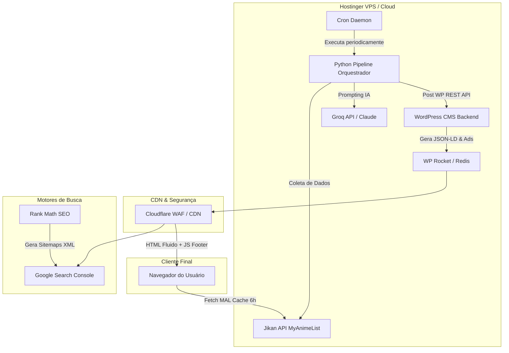

# 🚀 Backlog de Desenvolvimento — Fase 3 (modomaratona.com)

> **Status do Projeto:** A Fase 1 (Componentes Estáticos) e a Fase 2 (Integração WordPress CMS, MyAnimeList frontend, Automação Editorial IA, Adsense, Adblock, Schemas JSON-LD e links de afiliados) foram concluídas com sucesso. O portal está totalmente integrado localmente.
> 
> **Objetivo da Fase 3 (Mês 3–6):** Transicionar o portal Geek ao Cubo do ambiente de desenvolvimento local para o servidor de produção Hostinger, implementar a rotina de importação massiva da Jikan MyAnimeList API em ondas, automatizar o pipeline Python via agendadores crontab no servidor de produção, e blindar o site com regras rígidas de segurança e otimizações de performance em escala de produção.

---

## 🗺️ Fluxo de Integração em Produção (Fase 3)

---

## ⚠️ Regra de Ouro de Execução (Absoluta)

> [!IMPORTANT]
> **As etapas deste backlog devem ser executadas UMA DE CADA VEZ.**
> **O backlog e o arquivo de controle de progresso (`task.md`) devem ser atualizados a cada nova realização de tarefa** antes de iniciar a próxima. O trabalho em paralelo ou o atropelo de etapas sem a devida validação é estritamente proibido para evitar regressions e bugs de pro### 📊 Sprint 1: Script de Importação e Sincronização em Ondas (Jikan MAL API)
> **Foco Local:** Desenvolver e testar scripts em back-office (Python/PHP) para realizar a carga inicial massiva do catálogo de animes no CPT `anime` local, gerando uma base populada e funcional antes do deploy em nuvem.

- [x] **Task 1.1: Script de Importação da Onda 1 (Top 500 Animes MAL)**
  * *Descrição:* Desenvolver script Python que consuma o endpoint `/top/anime` da Jikan API e cadastre os 500 animes mais populares do MyAnimeList no WordPress local CPT `anime`, preenchendo todos os campos ACF (`anime_id_mal`, `anime_studio`, `anime_nota_mal`, `anime_imagem_capa_url`, status de exibição, etc.).
- [x] **Task 1.2: Sistema de Rate Limit & Waves em Lotes (Onda 2 & Onda 3)**
  * *Descrição:* Implementar lógica robusta de lotes para processar a **Onda 2** (animes em exibição + anos 2020-2025, ~2.000 páginas) e a **Onda 3** (resto do catálogo relevante com nota > 7 e members > 10k, ~5.000 páginas). Integrar controle estrito de rate limits (HTTP 429) usando retardos dinâmicos (`time.sleep`) e cache temporário local em JSON.
- [x] **Task 1.3: Rotina de Sincronização Contínua Diária**
  * *Descrição:* Criar uma tarefa agendada rápida de sincronização diária para varrer animes que estejam no status "Em Exibição" e atualizar no WP a nota média do MAL, membros e a contagem de episódios mais recente.

---

### 🤖 Sprint 2: Automatização Agendada do Pipeline Editorial Python
> **Foco Local:** Implementar o agendador de tarefas e logs locais para validar o fluxo contínuo do pipeline antes de rodá-lo na nuvem Hostinger.

- [x] **Task 2.1: Configurar Pipeline Cron Local**
  * *Descrição:* Configurar rotinas agendadas locais para rodar o orquestrador `pipeline.py` e validar as frequências do briefing: coleta a cada 6h, calendários 1x por dia, evergreen 1x por semana.
  * *Entregáveis:* `scheduler.py` (daemon APScheduler com 3 jobs + lock anti-zumbi), `run_scheduler.bat`, `stop_scheduler.bat`, `setup_windows_task.ps1`. Todos os jobs validados com `--test-run` e `--status`. Log rotativo em `automation/logs/scheduler.log` confirmado.
- [x] **Task 2.2: Sistema de Logs, Rotação e Alertas de Pipeline**
  * *Descrição:* Implementar logs locais rotativos e alertas automáticos via Webhook (Slack / Discord) caso o pipeline local falhe por credenciais REST inválidas ou rate limit.
  * *Entregáveis:* `alerts.py` (módulo de alertas com suporte a Discord e Slack, cooldown anti-spam de 300s, 3 retries automáticos e tail de log incluído no alerta). Integrado ao `scheduler.py` via wrapping de `_run_script`. Variável `WEBHOOK_URL` adicionada ao `.env.example`. Validado em dry-run com `python alerts.py --test` e `python scheduler.py --test-alert`.

---

### 🛡️ Sprint 3: Infraestrutura de Produção, Otimização de Performance & DNS
> **Foco Produção:** Migrar o WordPress local com o banco de dados JÁ populado e funcional para a Hostinger, apontar o domínio, configurar cache no servidor, CDN e sitemaps SEO.

- [ ] **Task 3.1: Migração do WordPress & Apontamento DNS**
  * *Descrição:* Configurar a zona DNS do domínio `modomaratona.com` apontando para os servidores da Hostinger (Cloud / VPS), exportar o banco de dados local limpo, transferir os arquivos do tema `hello-child` e reconfigurar URLs internas do banco.
- [ ] **Task 3.2: Otimização de Cache e CDN (WP Rocket & Cloudflare)**
  * *Descrição:* Ativar e configurar o WP Rocket (geração de CSS crítico inline, adiamento e minificação de HTML/JS/CSS). Integrar o Cloudflare como proxy WAF para compressão Brotli, otimização de imagens WebP e regras rígidas de cache de página estática.
- [ ] **Task 3.3: Conectar Search Console, GA4 & Sitemaps XML**
  * *Descrição:* Ativar a geração dinâmica de sitemaps XML pelo plugin Rank Math SEO. Validar o domínio no Google Search Console, enviar o sitemap e integrar a tag de acompanhamento assíncrona do Google Analytics 4 no cabeçalho.

---

### 🔒 Sprint 4: Protocolo Rígido de Segurança de Produção
> **Foco Produção:** Blindar a instalação do WordPress contra ataques comuns e acessos não autorizados antes do tráfego orgânico escalar na Hostinger.

- [ ] **Task 4.1: Ocultamento do Painel de Admin, 2FA & Permissões**
  * *Descrição:* Configurar ocultação do endpoint nativo `/wp-admin` e `/wp-login.php` para um caminho customizado seguro. Ativar autenticação de dois fatores (2FA) para administradores e editores, e auditar permissões de arquivos (644 para arquivos php, 755 para pastas).
- [ ] **Task 4.2: Backup Automatizado Diário Baseado na Nuvem**
  * *Descrição:* Configurar rotina externa automatizada (usando plugins como UpdraftPlus integrados ao Google Drive ou scripts de cron dump para AWS S3) para realizar backup completo diário do banco de dados e pasta de uploads com retenção cíclica de 30 dias.
- [ ] **Task 4.3: Blindagem do `wp-config.php` & Diretivas `.htaccess`**
  * *Descrição:* Mover o arquivo `wp-config.php` um nível acima da raiz pública do Apache/Litespeed para anular leituras externas. Aplicar diretivas estritas contra hotlinking de imagem, injeção de SQL e XSS no `.htaccess` do servidor.

---

## 🏆 Definição de Pronto (Fase 3)

Para que qualquer etapa da Fase 3 seja considerada concluída, ela deve passar pelos seguintes critérios de aceitação:

1. **Core Web Vitals >= 90:** A pontuação do mobile e desktop no Pagespeed Insights deve estar na faixa verde, com LCP inferior a 2.5 segundos e CLS zero.
2. **Logs sem Erro de Rastreamento:** Zero falhas de requisição na integração do Python com a API REST do WP e com a Jikan API.
3. **Auditoria de Segurança A+:** Domínio configurado com certificados SSL/TLS estritos, diretivas HTTP de cabeçalhos de segurança ativas no Cloudflare e varreduras de malware limpas.
4. **Resiliência do Agendador:** O pipeline cron deve ser validado para rodar sem travar processos zombies em segundo plano do servidor.
