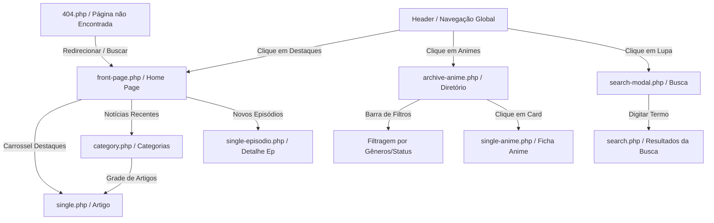

# 🚀 Backlog de Desenvolvimento — Fase 4: Construção das Páginas do Portal (Home, Arquivos, Busca & Categorias) & Navegação Completa

> **Status do Projeto:** A Fase 1 (Visual Estático), Fase 2 (Conectividade CMS & IA Local) e Sprints 1 e 2 da Fase 3 (Carga de Animes Jikan MAL API & Agendador Orquestrador Python) estão 100% concluídas e operando localmente no **LocalWP** e versionadas via **GitHub**. As tarefas de infraestrutura física, DNS, SSL e segurança em nuvem (Sprints 3 e 4 da Fase 3) permanecem em aberto para o mês que vem.
> 
> **Objetivo desta Nova Fase 4 (Mês 3-4):** Transicionar o portal de uma vitrine isolada de componentes (`storybook.html`) e templates de detalhes (`single-anime.php`, etc.) para um **site completo, navegável e funcional**. Vamos construir a Página Inicial (Home), os Arquivos de Categorias de Notícias, o Diretório completo de Animes com barra de filtros, os Resultados de Busca Globais e interligar toda a navegação do portal (Header, Footer e Mobile Drawer).

---

## 🗺️ Fluxo de Telas e Navegação (Fase 4)

---

## ⚠️ Regra de Ouro de Execução (Absoluta)

> [!IMPORTANT]
> **Conforme o padrão do projeto, todas as implementações desta Fase 4 devem ser desenvolvidas de forma estritamente modular (Atomic Design), mobile-first com CSS fluido (`clamp()`), unidades relativas (`rem`) e documentadas nos diretórios físicos (`docs/` e `storybook.html`) com o respectivo registro no `changelog.md` antes de qualquer entrega ser concluída.**

---

### 📊 Sprint 1: Página Inicial Editorial (Home / `front-page.php`)
> **Foco Interno/Local:** Montar a página principal do portal de forma dinâmica, consumindo as notícias cadastradas e os animes/episódios do banco de dados local.

- [x] **Task 1.1: Estruturar o Template Físico `front-page.php`**
  * *Descrição:* Criar o arquivo `front-page.php` na raiz do tema child. Integrar o cabeçalho (`get_header()`) e rodapé (`get_footer()`) semânticos e criar uma grade de duas colunas para desktop (Coluna Principal de 2.2fr + Sidebar de 1fr).
  * *Entregáveis:* `hello-child/front-page.php`, `hello-child/front-page.css`, e documentação estrutural.

- [x] **Task 1.2: Integrar o Carrossel de Destaques Editoriais (`secao-carrossel-destaque`)**
  * *Descrição:* Desenvolver o organismo `secao-carrossel-destaque` no topo da Home. A query do WordPress deve buscar os 3 últimos posts com a categoria/tag "Destaque" e renderizá-los em um carrossel fluido com navegação em dots e setas, usando scroll snap CSS (sem carregar jQuery).
  * *Entregáveis:* `hello-child/organisms/secao-carrossel-destaque.php` e `.css`, arquivos JavaScript de navegação local, e atualização do `storybook.html`.

- [x] **Task 1.3: Integrar a Grade de Notícias Recentes (`secao-noticias-recentes`)**
  * *Descrição:* Implementar o organismo `secao-noticias-recentes` logo abaixo dos destaques. O layout deve conter 1 card em super destaque (Hero Card horizontal) para a notícia mais recente, seguido de uma grade responsiva com 3 cards secundários (`card-noticia.php`). Incluir paginação numérica ou botão de carregamento infinito via AJAX local.
  * *Entregáveis:* `hello-child/organisms/secao-noticias-recentes.php` e `.css`, e documentação do componente.

- [ ] **Task 1.4: Integrar a Esteira de Novos Episódios (`secao-novos-episodios`)**
  * *Descrição:* Inserir na Home uma esteira horizontal (`secao-novos-episodios` usando o `trilho-infinito`) exibindo os episódios mais recentes adicionados do CPT `episodio`, exibindo o número do episódio, a imagem de capa e o status de exibição.
  * *Entregáveis:* `hello-child/organisms/secao-novos-episodios.php` e `.css`, integrado ao `front-page.php`.

---

### 🔍 Sprint 2: Diretório de Animes e Busca Avançada (`archive-anime.php` & `search.php`)
> **Foco Interno/Local:** Oferecer aos usuários uma interface completa de pesquisa, listagem e filtragem de todo o acervo de 500+ animes cadastrados na base local.

- [ ] **Task 2.1: Criar o Template do Diretório (`archive-anime.php`)**
  * *Descrição:* Desenvolver o template de arquivo do CPT `anime` (`archive-anime.php`) exibindo o cabeçalho do diretório e uma grade responsiva auto-fill (`grid-animes`) que lista de forma paginada todos os animes do acervo usando o componente `card-anime.php`.
  * *Entregáveis:* `hello-child/archive-anime.php`, `hello-child/organisms/grid-animes.php` e `.css`.

- [ ] **Task 2.2: Desenvolver a Barra de Filtros Dinâmicos (`barra-filtros`)**
  * *Descrição:* Desenvolver o organismo `barra-filtros` no topo do diretório. A barra deve conter seletores para filtrar os animes por Gênero (taxonomia `genero`), Status (taxonomia `status_exibicao`), Temporada (relacionamento) e Ano de Lançamento. O processamento deve atualizar a query do WordPress via AJAX local sem recarregar a página inteira.
  * *Entregáveis:* `hello-child/organisms/barra-filtros.php` e `.css`, scripts JS associados e documentação de uso.

- [ ] **Task 2.3: Estruturar a Página de Busca Global (`search.php`)**
  * *Descrição:* Criar o template `search.php` para exibir de forma elegante os termos pesquisados pelo usuário no site. Dividir os resultados em seções claras: "Notícias Encontradas", "Animes Relacionados" e "Análises (Reviews)". Exibir mensagem elegante de "Nenhum resultado encontrado" caso a pesquisa seja vazia.
  * *Entregáveis:* `hello-child/search.php`, estilizações e layouts semânticos no CSS global.

---

### 📰 Sprint 3: Arquivos de Categorias, Tags e Tratamento de Erros (`category.php` & `404.php`)
> **Foco Interno/Local:** Garantir que todas as páginas secundárias, listagens editoriais por termos e telas de erro tenham o design premium, acessível e sem dependências de bloat.

- [ ] **Task 3.1: Template de Categorias e Tags de Notícias (`category.php` / `tag.php`)**
  * *Descrição:* Criar o template genérico de taxonomia e arquivo (`category.php`, `tag.php` e `archive.php`) para exibir as listas de notícias de categorias específicas (como "Guias", "Novidades", "Curiosidades"). O layout deve usar uma grade de `card-noticia.php` com paginação numérica acessível.
  * *Entregáveis:* `hello-child/category.php`, `hello-child/archive.php` e documentação.

- [ ] **Task 3.2: Desenvolver a Tela 404 Personalizada (`404.php`)**
  * *Descrição:* Construir uma tela de Erro 404 (`404.php`) premium com ilustrações temáticas de anime (ex: "Parece que você pegou o caminho errado, como o Zoro!"), uma mensagem explicativa com tom humorado geek, um botão proeminente de retorno para a Home e um formulário de busca integrado.
  * *Entregáveis:* `hello-child/404.php`, `hello-child/404.css` e documentação.

---

### 🗺️ Sprint 4: Interligação e Fluxo de Navegação Global (Menus & Modais)
> **Foco Interno/Local:** Ativar os componentes interativos do cabeçalho e rodapé do site para conectar todas as páginas e oferecer caminhos fluidos de transição ao usuário.

- [ ] **Task 4.1: Registrar e Ativar Menus no WordPress (`navigation-drawer` & `header`)**
  * *Descrição:* Registrar as posições dos menus no `functions.php` (Menu Principal Header, Menu Mobile Drawer, Menu Rodapé). Configurar no painel do WordPress local e renderizar os itens dinamicamente no `organisms/header.php` e no overlay deslizante do `organisms/navigation-drawer.php` via PHP nativo.
  * *Entregáveis:* Registros no `functions.php` e templates do `header.php` e `navigation-drawer.php` atualizados e funcionando de forma responsiva.

- [ ] **Task 4.2: Conectar o Disparador do Modal Global de Busca (`search-modal`)**
  * *Descrição:* Integrar o átomo `btn-busca-trigger` no cabeçalho do site. Ao ser clicado, deve disparar a exibição em tela cheia do `organisms/search-modal.php` com animação suave de fade-in, capturando automaticamente o foco do teclado para o campo de input e fechando ao clicar fora ou apertar a tecla `ESC`.
  * *Entregáveis:* Conexão concluída com scripts JavaScript locais validados para acessibilidade WCAG 2.2 AA.

---

## 🏆 Critérios de Aceitação de Pronto (Definition of Done)

Para que qualquer tela desta Fase 4 seja considerada pronta localmente no repositório:

1. **Navegabilidade 100% Fluida**: É possível navegar por toda a estrutura do site (da Home ao diretório, filtrando animes, fazendo buscas, abrindo o artigo de notícias e voltando para a Home) sem erros de link quebrado (`404`) ou tela em branco.
2. **Design Fluido por Variáveis**: Nenhum elemento das novas páginas pode conter valores CSS fixos em pixels. Tudo deve referenciar o `design-tokens.css` e usar escalas fluidas com `clamp()`.
3. **Consumo Correto de Queries WP**: As páginas devem consumir posts e metadados reais locais (nada de conteúdo estático fixado no código).
4. **Respeito às Windsurfrules**: Cada template PHP deve estar mapeado e referenciado na pasta `docs/` e na vitrine `storybook.html`.

---

## 📅 Próximo Passo sugerido para o Usuário:
Recomendamos analisar este novo plano de páginas dinâmicas e, se estiver de acordo, responder **"Aprovado o Backlog das Páginas Principais"** para que possamos catalogar oficialmente este documento e iniciar as tarefas no seu repositório local!
